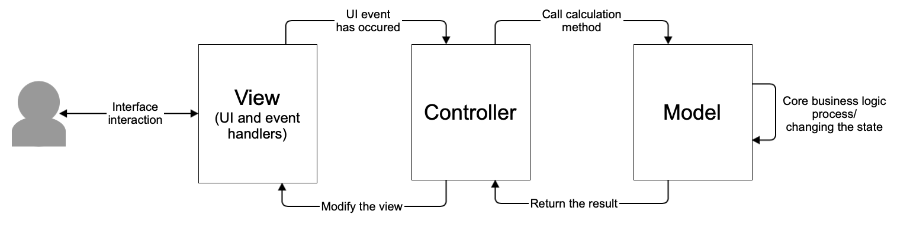
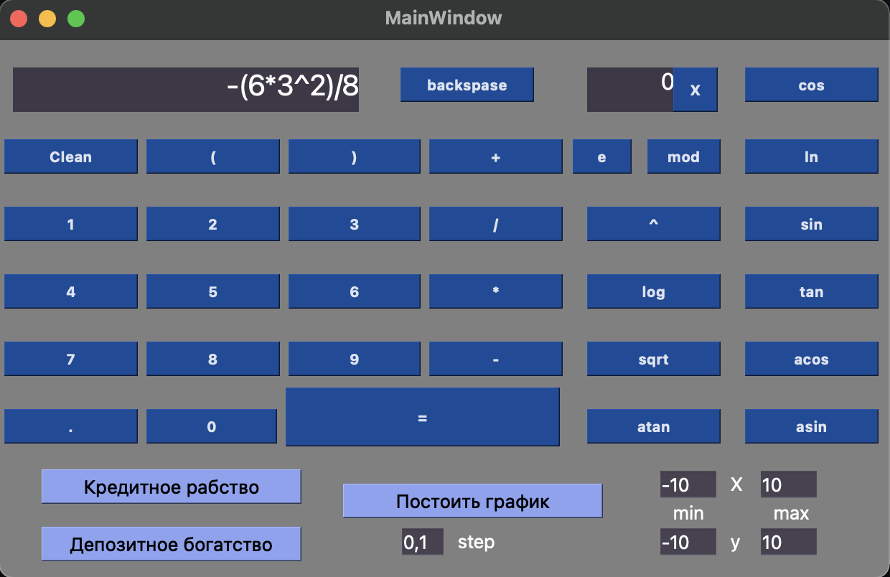
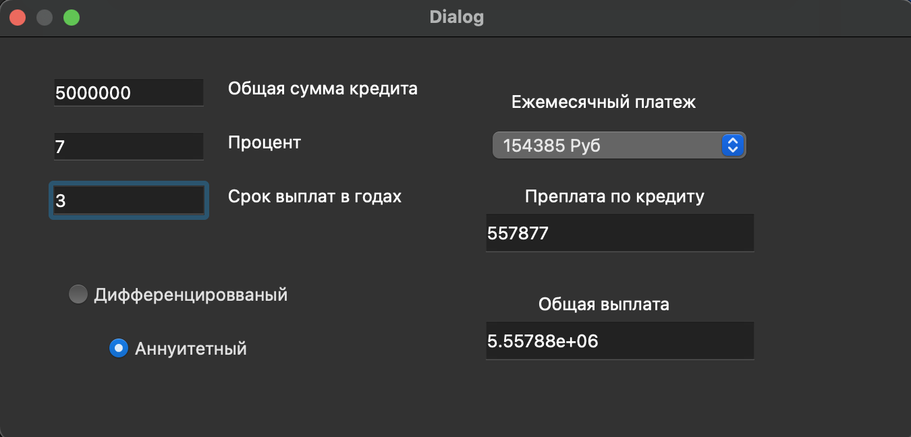
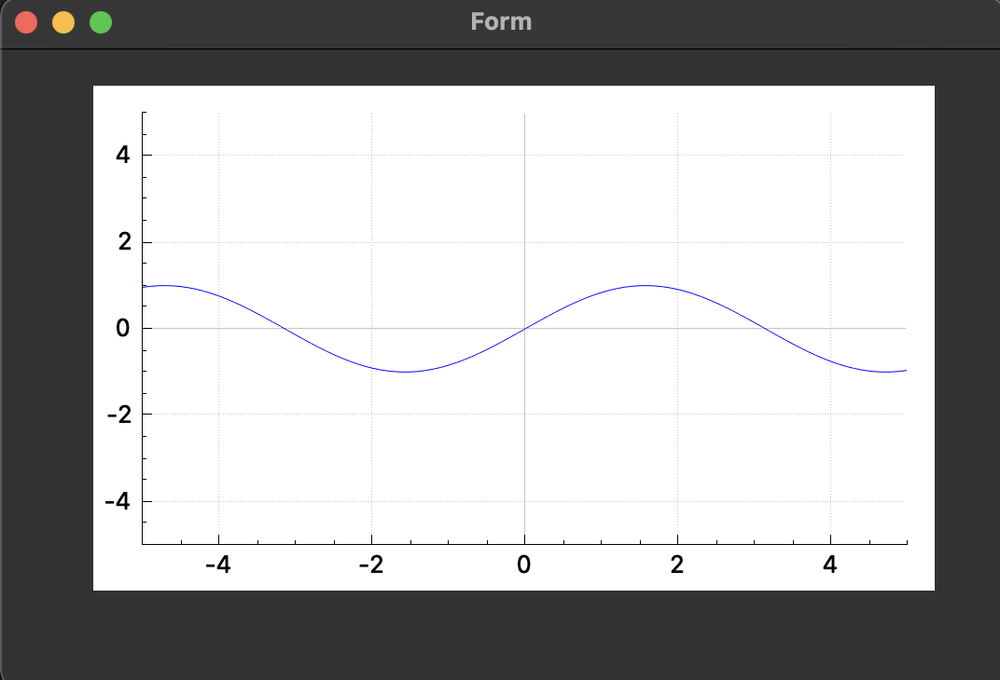

# SmartCalc v2.0

Реализация SmartCalc v2.0

Makefile имеет цели all, install, uninstall, clean, dvi, test. Установка должна вестись в любой другой произвольный каталог

При написании проекта использовался патерн проектирования MVC

Что умеет калькулятор

   - **Арифметические операторы**:  

        | Название оператора | Инфиксная нотация   (Классическая) | Префиксная нотация   (Польская нотация) |  Постфиксная нотация   (Обратная польская нотация) |
        | ------ | ------ | ------ | ------ |
        | Скобки | (a + b) | (+ a b) | a b + |
        | Сложение | a + b | + a b | a b + |
        | Вычитание | a - b | - a b | a b - |
        | Умножение | a * b | * a b | a b * |
        | Деление | a / b | / a b | a b \ |
        | Возведение в степень | a ^ b | ^ a b | a b ^ |
        | Остаток от деления | a mod b | mod a b | a b mod |
        | Унарный плюс | +a | +a | a+ |
        | Унарный минус | -a | -a | a- |

        

   - **Функции**:
  
        | Описание функции | Функция |   
        | ---------------- | ------- |  
        | Вычисляет косинус | cos(x) |   
        | Вычисляет синус | sin(x) |  
        | Вычисляет тангенс | tan(x) |  
        | Вычисляет арккосинус | acos(x) | 
        | Вычисляет арксинус | asin(x) | 
        | Вычисляет арктангенс | atan(x) |
        | Вычисляет квадратный корень | sqrt(x) |
        | Вычисляет натуральный логарифм | ln(x) | 
        | Вычисляет десятичный логарифм | log(x) |

## Part 2. Дополнительно. Кредитный калькулятор

Предусмотреть специальный режим "кредитный калькулятор"
 - Вход: общая сумма кредита, срок, процентная ставка, тип (аннуитетный, дифференцированный)
 - Выход: ежемесячный платеж, переплата по кредиту, общая выплата
 

## Part 3. Постройка графиков используя вводные данные

Предусмотренно ручное изменение маштаба, и шага линий прорисовки

